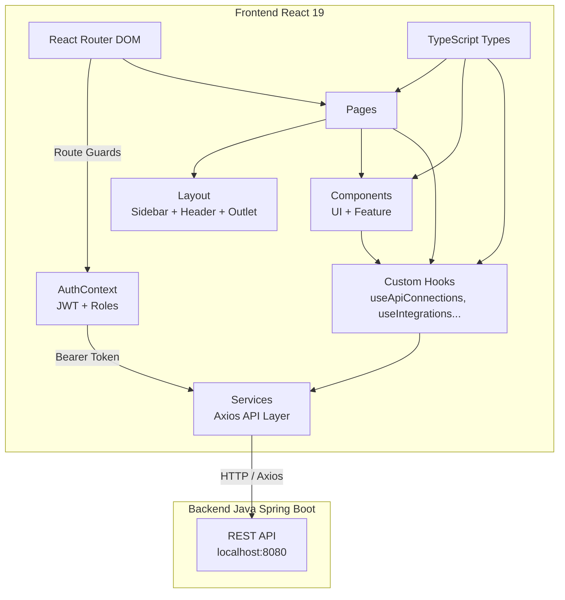
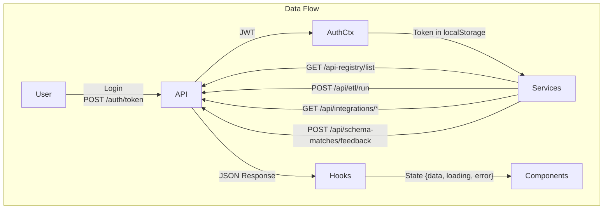
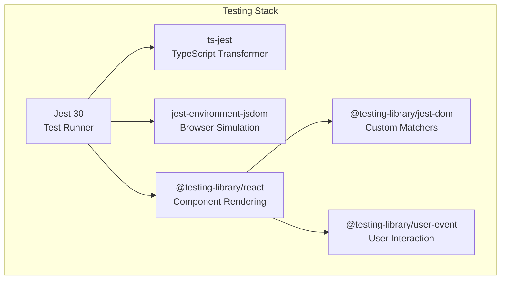
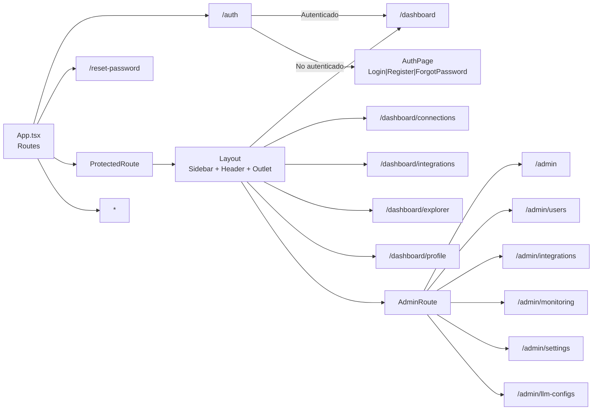
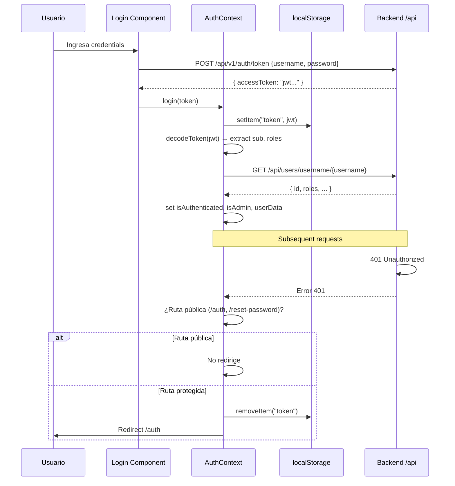
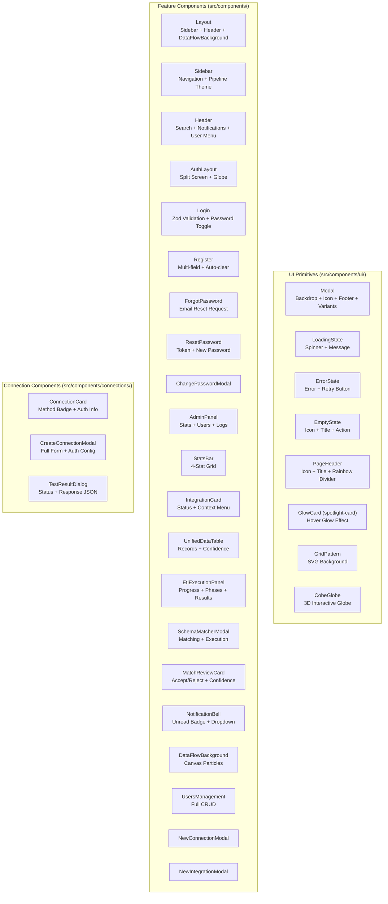
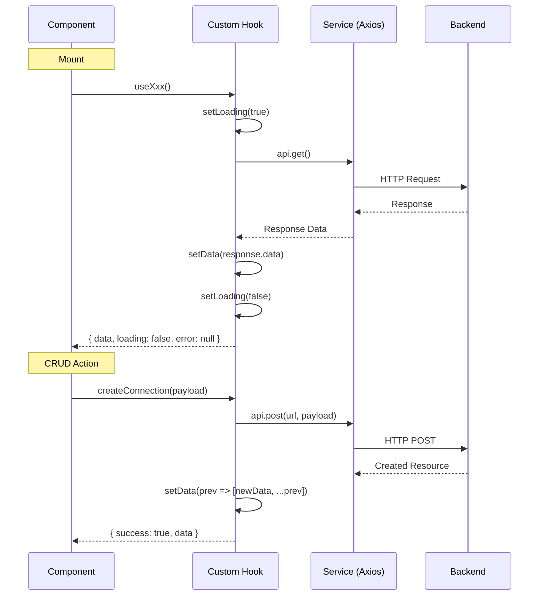
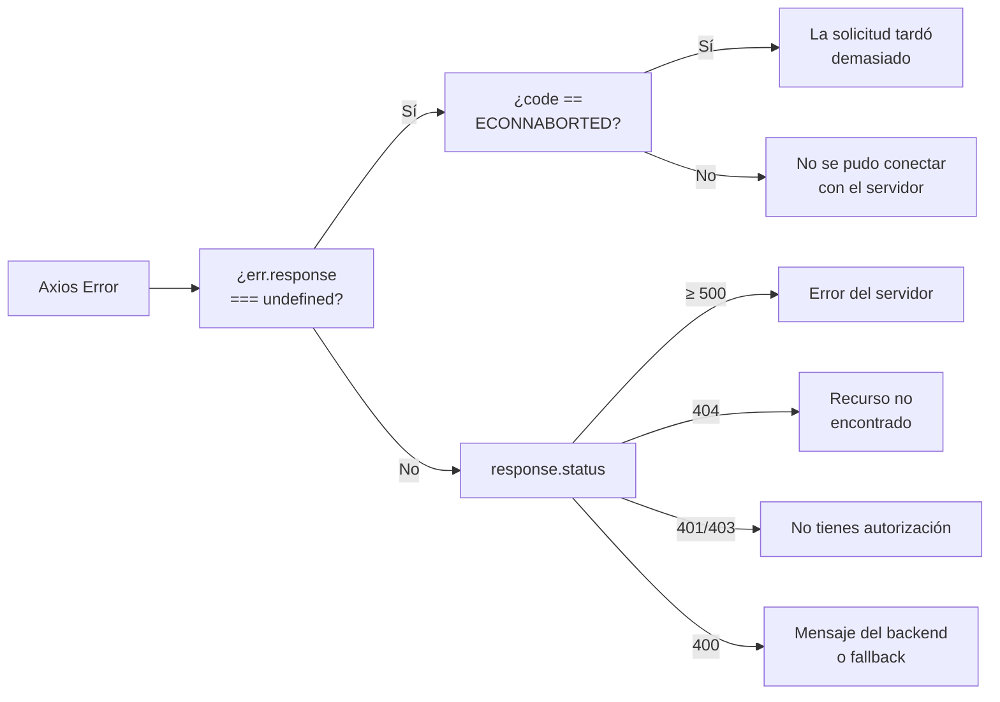
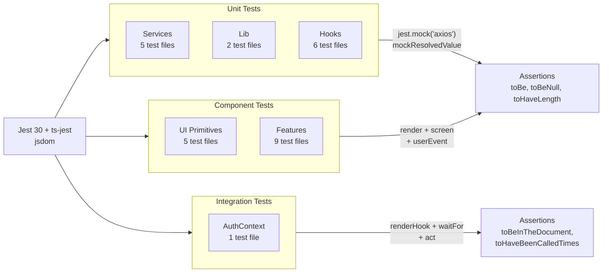
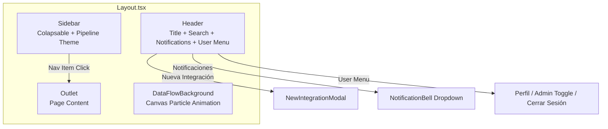

# ETL Automate — Frontend

Plataforma de integración y automatización ETL con panel de administración, gestor de conexiones API, y orquestación de pipelines de datos. UI en español, construida con React 19 + TypeScript + Tailwind CSS.

---

## Tabla de Contenidos

- [Arquitectura](#arquitectura)
- [Tech Stack](#tech-stack)
- [Estructura del Proyecto](#estructura-del-proyecto)
- [Routing](#routing)
- [Autenticación](#autenticación)
- [Componentes](#componentes)
- [Hooks y Estado](#hooks-y-estado)
- [Servicios y API](#servicios-y-api)
- [Pruebas](#pruebas)
- [Desarrollo](#desarrollo)
- [CI/CD](#cicd)
- [Docker](#docker)

---

## Arquitectura





---

## Tech Stack

| Categoría | Tecnología |
|-----------|-----------|
| **Framework** | React 19.2.6 |
| **Build** | Vite 5.4 |
| **Lenguaje** | TypeScript 5.5 (strict) |
| **Estilos** | Tailwind CSS 3.4 + `clsx` + `tailwind-merge` (`cn()`) |
| **Routing** | React Router DOM 7.15 |
| **Formularios** | React Hook Form 7.75 + Zod 4.4 |
| **HTTP** | Axios 1.16 |
| **Animación** | Motion 12 (Framer Motion), Three.js 0.184, Cobe 2.0 (globo 3D) |
| **Iconos** | Lucide React 1.14 |
| **Testing** | Jest 30 + ts-jest + Testing Library |
| **Linting** | ESLint 9 + typescript-eslint + react-hooks + react-refresh |



---

## Estructura del Proyecto

```
src/
├── __mocks__/              # Mock manual de axios (TypeScript)
├── assets/                 # Assets estáticos (texturas, imágenes)
├── components/             # Componentes React
│   ├── connections/        #   Gestor de conexiones API
│   ├── ui/                 #   Primitivas UI reutilizables
│   └── __tests__/          #   Tests de componentes
├── context/                # React Context (AuthContext)
├── hooks/                  # Custom hooks con estado async
│   └── __tests__/
├── lib/                    # Utilidades (apiError, cn)
│   └── __tests__/
├── pages/                  # Componentes de página (rutas)
├── services/               # Capa HTTP (Axios + servicios)
│   └── __tests__/
├── test/                   # Setup de tests
└── types/                  # Interfaces y tipos compartidos
```

---

## Routing



| Ruta | Acceso | Componente |
|------|--------|-----------|
| `/auth` | Público | `AuthPage` (Login / Register / ForgotPassword) |
| `/reset-password?token=` | Público | `ResetPassword` |
| `/dashboard` | Protegido | `DashboardPage` |
| `/dashboard/connections` | Protegido | `ConnectionsPage` |
| `/dashboard/integrations` | Protegido | `IntegrationsPage` |
| `/dashboard/explorer` | Protegido | `DataExplorerPage` |
| `/dashboard/profile` | Protegido | `ProfilePage` |
| `/admin` | Admin | `AdminPage` |
| `/admin/users` | Admin | `UsersManagement` |
| `/admin/integrations` | Admin | `AdminIntegrationsPage` |
| `/admin/monitoring` | Admin | `MonitoringPage` |
| `/admin/settings` | Admin | `AdminSettingsPage` |
| `/admin/llm-configs` | Admin | `AdminLlmConfigsPage` |

---

## Autenticación



- **JWT** se almacena en `localStorage` clave `token`
- **Interceptor** de Axios inyecta `Authorization: Bearer <token>` en cada request
- **Response interceptor** captura 401 y redirige a `/auth` (excepto en rutas públicas)
- **Roles** extraídos del payload JWT (`sub`, `roles`)
- **Admin view toggle** — usuarios admin pueden alternar vista admin/user

---

## Componentes



---

## Hooks y Estado

Cada hook expone el mismo patrón: fetch en mount + estado `{data, loading, error}` + operaciones CRUD.

| Hook | Endpoints | Operaciones |
|------|-----------|------------|
| `useApiConnections` | `GET /api-registry/list`, `POST`, `DELETE`, `POST /{id}/test` | `create`, `delete`, `test`, `refetch` |
| `useIntegrations` | `GET /api/integrations/connections`, `POST`, `POST /{id}`, `DELETE /{id}` | `create`, `update`, `delete`, `refetch` |
| `useEtlExecution` | `POST /api/etl/run/{integrationId}` | `execute`, `reset` |
| `useLlmConfigs` | `GET /api/llm-configs`, `POST`, `PUT /{id}`, `DELETE /{id}`, `PATCH /{id}/default` | `create`, `update`, `delete`, `setDefault`, `refetch` |
| `useUnifiedRecords` | `GET /api/schema-matches` | `refetch` |
| `useUsers` | `GET /api/users`, `DELETE /api/users/{id}` | `deleteUser`, `refetch` |



---

## Servicios y API

### Endpoints

| Método | Endpoint | Servicio | Propósito |
|--------|----------|----------|-----------|
| POST | `/api/v1/auth/token` | Auth | Login |
| POST | `/api/users/register` | Auth | Registro |
| GET | `/api/users/username/{username}` | Auth | Perfil por username |
| GET | `/api/users` | Admin | Listar usuarios |
| PUT | `/api/users/{id}` | Admin | Actualizar usuario |
| DELETE | `/api/users/{id}` | Admin | Eliminar usuario |
| POST | `/api/users/{id}/verify-email` | Admin | Verificar email |
| POST | `/api/users/{id}/activate` | Admin | Activar usuario |
| POST | `/api/users/{id}/deactivate` | Admin | Desactivar usuario |
| POST | `/api/users/forgot-password` | Auth | Solicitar reset |
| POST | `/api/users/reset-password` | Auth | Ejecutar reset |
| GET | `/api/users/roles` | Admin | Listar roles |
| POST | `/api/user-roles/assign` | Admin | Asignar rol |
| DELETE | `/api/user-roles/remove` | Admin | Remover rol |
| GET | `/api-registry/list` | Connections | Listar conexiones |
| POST | `/api-registry` | Connections | Crear conexión |
| DELETE | `/api-registry/{id}` | Connections | Eliminar conexión |
| POST | `/api-registry/{id}/test` | Connections | Testear conexión |
| GET | `/api/integrations/connections` | Integrations | Listar integraciones |
| POST | `/api/integrations/connections` | Integrations | Crear integración |
| POST | `/api/integrations/connections/{id}` | Integrations | Actualizar integración |
| DELETE | `/api/integrations/connections/{id}` | Integrations | Eliminar integración |
| GET | `/api/schema-matches` | Matching | Listar matches |
| GET | `/api/schema-matches/integration/{id}` | Matching | Matches por integración |
| POST | `/api/schema-matches/feedback` | Matching | Feedback de match |
| POST | `/api/integrations/connections/{id}/run-matching` | Matching | Ejecutar matching |
| POST | `/api/etl/run` | ETL | Ejecutar ETL |
| POST | `/api/etl/run/{id}` | ETL | Ejecutar por integración |
| GET | `/api/llm-configs` | LLM | Listar configs |
| POST | `/api/llm-configs` | LLM | Crear config |
| PUT | `/api/llm-configs/{id}` | LLM | Actualizar config |
| DELETE | `/api/llm-configs/{id}` | LLM | Eliminar config |
| PATCH | `/api/llm-configs/{id}/default` | LLM | Set default |
| GET | `/api/integrations/logs` | Logs | Logs del sistema |

### Mapeo de Errores (`mapApiError`)



---

## Pruebas



### Ejecución

```bash
npm test              # Jest (all tests)
npm run test:watch    # Watch mode
npm run test:coverage # Con cobertura
npm run test:verbose  # Verboso
```

### Tests por categoría

| Categoría | Archivos | Estrategia |
|-----------|----------|------------|
| **Services** | `api.test.ts`, `etlService.test.ts`, `logService.test.ts`, `notificationService.test.ts`, `schemaMatchService.test.ts` | Mock de Axios, aserciones en endpoints y headers |
| **Hooks** | `useApiConnections.test.ts`, `useIntegrations.test.ts`, `useUnifiedRecords.test.ts`, `useUsers.test.ts`, `useLlmConfigs.test.ts`, `useEtlExecution.test.ts` | `renderHook` + `waitFor` + `act`, mock de api |
| **Components** | `Header.test.tsx`, `IntegrationCard.test.tsx`, `NotificationBell.test.tsx`, `StatsBar.test.tsx`, `ResetPassword.test.tsx`, `ChangePasswordModal.test.tsx`, `ForgotPassword.test.tsx`, `Register.test.tsx`, Modal, LoadingState, ErrorState, PageHeader, EmptyState | `render` + `screen` + `userEvent`, mock de dependencias |
| **Auth Context** | `AuthContext.test.tsx` | JWT mock, localStorage, render con provider |

---

## Desarrollo

### Requisitos

- Node.js 18+
- npm

### Instalación

```bash
npm install
```

### Comandos

```bash
npm run dev          # Vite dev server (hot reload)
npm run build        # Build producción
npm run preview      # Preview build
npm run typecheck    # TypeScript strict check
npm run lint         # ESLint
npm test             # Jest tests
```

### Variables de entorno

El `baseURL` de Axios está hardcodeado a `http://localhost:8080`. El `docker-compose.yml` define `VITE_API_URL` pero actualmente no se referencia en el código.

---

## CI/CD

```yaml
# .github/workflows/qa-tests.yml — se ejecuta en push a qa
#   - npm run typecheck
#   - npm run test:coverage
#   - npm run lint
```

---

## Docker

```bash
docker compose up    # Inicia frontend en puerto 5173
```

Basado en `node:18-alpine`, expone en `0.0.0.0:5173` con hot reload.

---

## Estructura de Layout



---

## Types Principales

```typescript
// src/types/index.ts
type IntegrationStatus = 'active' | 'pending' | 'error' | 'inactive';

interface Integration {
  id: string;
  name: string;
  source: string;
  status: IntegrationStatus;
  lastRun: string;
  recordsProcessed: number;
  mlBadge?: string;
}

interface SchemaMatch {
  id: number;
  integrationId: number;
  sourceField: string;
  targetField: string;
  confidence: number;
  status: 'PENDING' | 'ACCEPTED' | 'REJECTED';
}

interface UnifiedRecord {
  unifiedId: string;
  entityName: string;
  originA: string;
  originB: string;
  confidence: number;
  highlight?: boolean;
}
```
